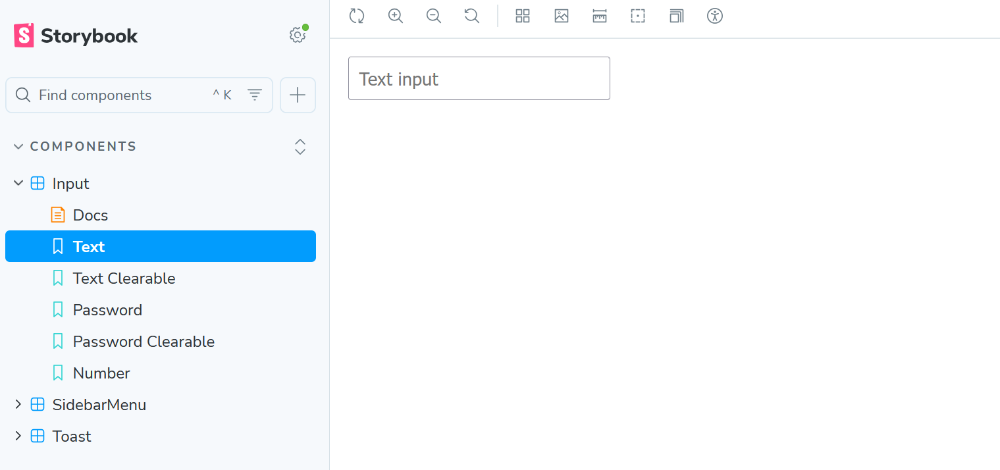
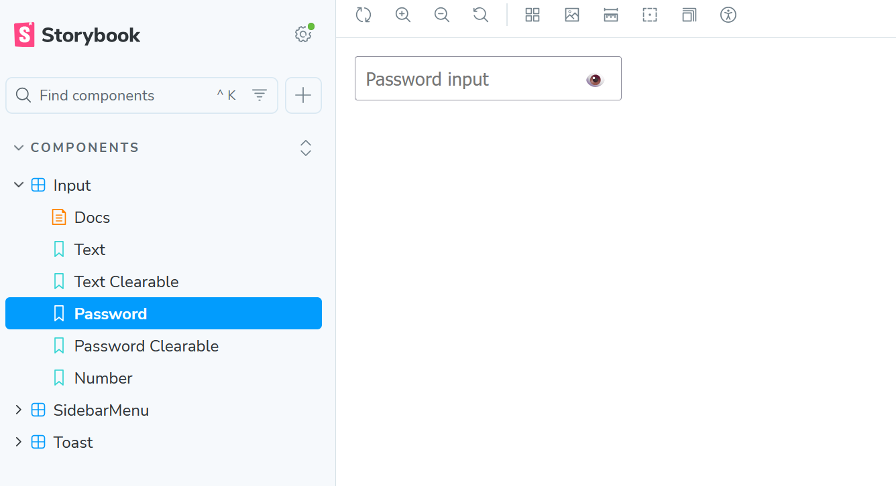
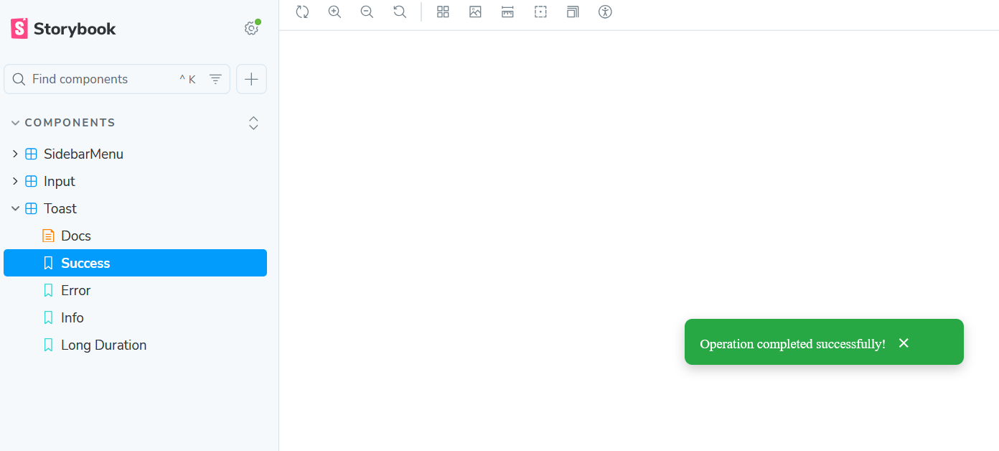
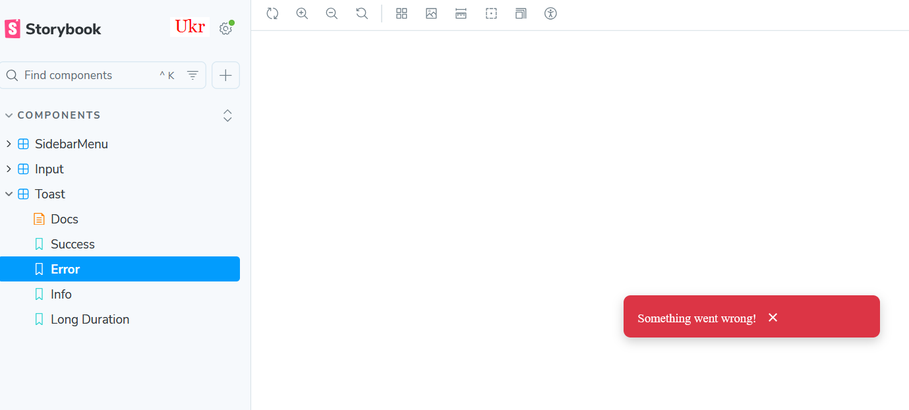
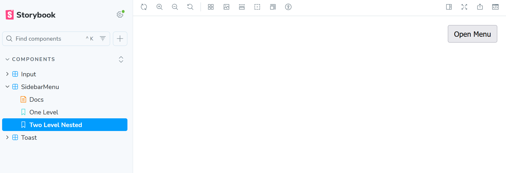

# React Component Library

This project contains three reusable **React components** with full **Storybook integration**.  
Each component demonstrates interactive UI behavior, transitions, and real-world usability patterns.

---

## 🧩 Components

### 1. Input Component

**Behavior:**
- Supports multiple input types (`text`, `password`, `number`)
- If `type="password"` → shows an 👁️ icon to toggle visibility  
- If `clearable=true` → shows ❌ button to clear input

**Storybook examples:**
- Text input (default)
- Password input with toggle
- Clearable text input

**Screenshots:**
- Default  
  
- Password Toggle  
  

---

### 2. Toast Component

**Behavior:**
- Appears at the bottom-right corner  
- Auto-dismisses after a set duration  
- Smooth fade-in / fade-out transitions  
- Optional manual close button  

**Storybook examples:**
- Success / Error / Info states  
- Different durations  
- With / without manual close

**Screenshots:**
- Success Toast  
  
- Error Toast  
  

---

### 3. Sidebar Menu Component

**Behavior:**
- Slides in from the right  
- Renders nested submenus (accordion-style)  
- Closes when clicking outside (background overlay)  

**Storybook examples:**
- Single-level menu  
- Two-level nested menu  
- Open / closed states

**Screenshots:**
- Closed  
  
- Open with Nested Items  
  

---

## 📖 Storybook

You can view and interact with all components directly in **Storybook**.

**Run locally:**

```bash
npm install
npm run storybook


Storybook will open automatically at:
👉 http://localhost:6006

🧰 Tech Stack
⚛️ React + TypeScript
🎨 CSS Modules for scoped styling
📚 Storybook for component documentation and testing

